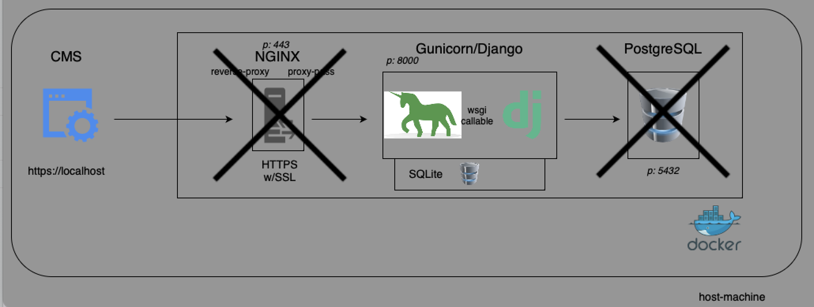

# DOCUMENTATION: Challange Customize PyEditorial
The original readme and source code are available in the master branch. This readme can be considered as an extension to the original readme.

### Setting up the Environment / Expectations
- [x] Assuming that the developer has an environment with an active development posture. It is assumed that the developer's unix-distro-machine has Git, IDE and Docker.

Setting up the Environment ready by using these commands;
```
# clone the customized project
git clone -b challenge/develop https://github.com/metinkeremurkmez/PyEditorial-customize.git
# go to the project DIR
cd PyEditorial
# Setting up
make setup
```


------------
## Technical Constraints:

- ++ The use of Python 3.8 and above and the naming convention are followed.
- ++ Separate containers have been thoughtfully employed to enhance the project's structure and scalability.
- -- The PostgreSQL service can be successfully up, but the Django service is unable to find it. Therefore, improvements related to PostgreSQL have been commented out to allow the Django service to run. So, SQLite were used.
++ Used gunicorn/django.

## Bonus Points:

- -- NGINX https were used, but it cannot actually fulfill its function. That's why Django resources were not protected. A conf that forces the use of HTTPS.
- ++ Visual diagram were pushed.

### ADDITIONAL NOTES:

Created a simple GA CI manifest to check the Functionality without containers that are not working properly.
There are other improvements as well but they are not critical.
Can see the transitions/differences between the original repo and my challenge on the PR page.
